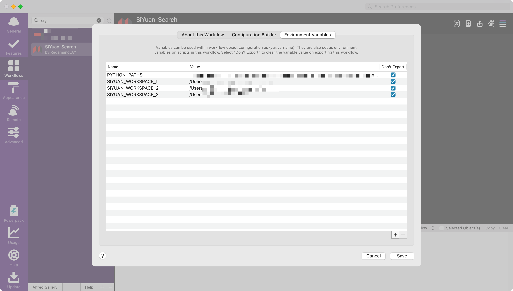
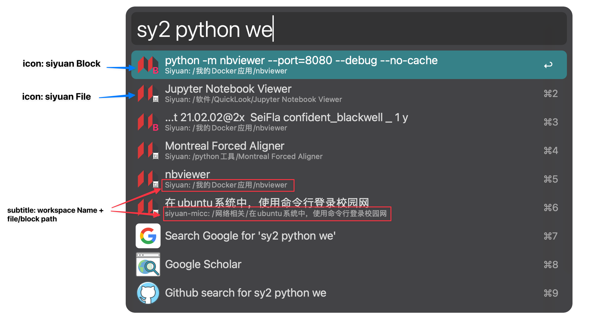

# Alfred-SiYuan-Search-workflow


This workflow aims to search siyuan content in the Alfred within multiple workspace.

If you only have one workspace, you should use [SiYuan-Search-workflow](https://github.com/huamang/SiYuan-Search-workflow),
which has the same function but is more simple.

## Python environment

This workflow use `python3` to run the workflow, please make sure you have python3 environment installed.


## Method

In siyuan, the "path/to/workspace/temp/siyuan.log" file contains the HTTP server port number. Therefore, we can read this log file and obtain the port number.

For example:
```
I 2025/01/26 17:37:08 serve.go:189: kernel [pid=31181] http server [127.0.0.1:56004] is booting
...
I 2025/01/25 22:21:47 serve.go:189: kernel [pid=88564] http server [0.0.0.0:52916] is booting
```

After obtaining the port number, we can use the HTTP API to search the content within multiple workspaces.


## Usage

### Environment Variabls


First, you must set the python paths to run the python script. Specifically, you can set multiple python paths, separated by `:`. For example:
```bash
path/of/python1:path/of/python2:path/of/python3
```

Second, you can set multiple siyuan workspaces, the format is `SIYUAN_WORKSPACE_xxx`. For example:
```bash
SIYUAN_WORKSPACE_1
SIYUAN_WORKSPACE_2
SIYUAN_WORKSPACE_3
```

### Run script

Set a shortcut key or use the keyword: `sy` to use it directly~


